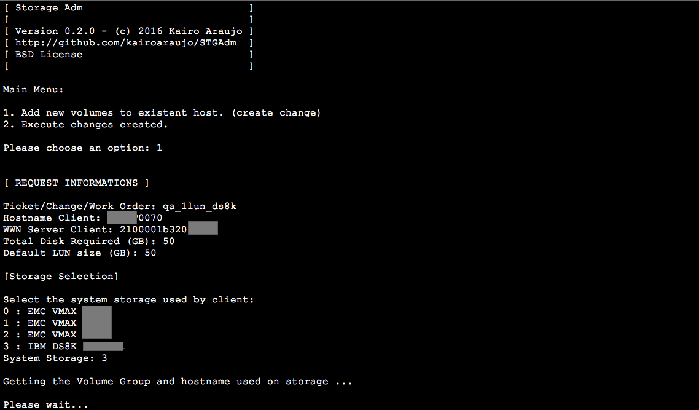

================================
STGAdm - Storage Disk Admin Tool
================================

.. image:: https://travis-ci.org/kairoaraujo/STGAdm.svg?branch=master
    :target: https://travis-ci.org/kairoaraujo/STGAdm

:STGAdm:      Storage Disk Admin Tool
:Copyright:   Copyright (c) 2016  Kairo Araujo <kairo@kairo.eti.br>
:License:     BSD
:Development: https://github.com/kairoaraujo/STGAdm

.. contents::
    :local:
    :depth: 2
    :backlinks: none

This is a util to use for Storage Disk Administration.

+--------+----------+
| Vendor | Models   |
+========+==========+
|        |  - VMAX  |
+ EMC    +  - VNX   |
|        |          |
+--------+----------+
| IBM    |  - DS8K  |
+--------+----------+

Version
-------

https://github.com/kairoaraujo/STGAdm/releases

    
Installation / Configuration / Using
------------------------------------

- Download latest version of STGAdm

    https://github.com/kairoaraujo/STGAdm/releases
 
- Uncompress the util

    $ unzip STGAdm-X.Y.Z.zip

    or

    $ tar xvzf STGADm-X.Y.Z.tar.gz

- Go to STGAdm dir and install the requirements

    $ cd STGAdm

    $ pip install -r requirements.txt

- Configure the STGAdm

    $ vi STGAdm/stgadm/config.py

- Execute the STGAdm

    $ python stgadm.py

An interactive menu will be appear. Have fun!

Screenshots
-----------

- Creating the change/ticket/wo

.. image:: images/ss-ds8k-1.png

    

- Executing the change/ticket/wo

.. image:: images/ss-ds8k-5.png

.. image:: images/ss-ds8k-6.png
